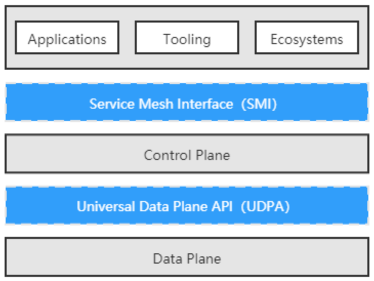

# 项目介绍
SOTA means "smart open traffic agent"，sota-mesh是一个基于golang实现的轻量的service mesh数据面，参考了envoy和mosn的部分实现，旨在作为istio的数据面存在，同时能够根据自己业务做定制化开发。

# 快速体验
## build
```
make; make sample
```
## 启动sota-mesh
```
./sota-mesh start -c ./conf/simple.yaml
```
## 启动demo server做测试
```
./cmd/sample/httpserver 8889
./cmd/sample/httpserver 8890
```
## curl请求验证
```
curl http://127.0.0.1:8888
可以看到请求按负载均衡算法转发到配置的后端服务
```

# 主要特性
## 资源配置抽象
由于目前没有成熟的通用数据平面 API（Universal Data Plane API，UDPA），这里参考了envoy的资源定义，做了接口封装，包括对listener、cluster、router等资源做了抽象，该项工作非常繁琐并且有待优化，参考pkg/config目录下的定义。


## envoy配置支持
支持envoy本身的配置文件，因为本身希望作为istio的数据面替换envoy。同时又可以实现自定义配置，启动参数根据-t指定配置类型。后续会支持envoy xds的实现。

## 插件框架
参照envoy的实现，定义了listener、network、http三种插件，可以在此基础上实现自定义的插件，目前实现了envoy的http manager插件和http route等几个插件。同时实现了network类型的simple line和zeromq插件的验证。

## dispatcher封装
在network侧封装了dispatcher转发器，方便在此基础上做协议插件开发，这里简单介绍下基于tcp的query参数协议的实现和zeromq协议的实现。
### query参数协议
该协议简单按key=value&key1=value1\r\n的方式约定，通过dispatcher可以快速进行协议扩展。参考pkg/dispatch/simple和pkg/filter/network/simple_line，协议处理的代码如下，可以看到非常简单。
```
type SimpleDispatcher struct {
	*dispatch.DispatcherImpl
}

func NewSimpeDispatcher(conn api.ConnectionCallbacks) dispatch.Dispatcher {
	dispatch, _ := dispatch.NewDispatcher(conn)
	dp := &SimpleDispatcher{DispatcherImpl: dispatch}
	go dp.serve()
	return dp
}

func (s *SimpleDispatcher) serve() {
	defer s.Close()
	for {
		line, _, err := s.Reader.ReadLine()
		if err != nil {
			log.Debug("close by peer")
			return
		}
		log.Debug("receive: %s", string(line))
		vs, err := url.ParseQuery(string(line))
		if err != nil {
			s.Conn.Write([]byte(err.Error()))
			return
		}
		s.Conn.Write([]byte(fmt.Sprintf("receive:%#v\r\n", vs)))
	}
}
```

### zeromq协议
zeromq的协议采用zmtp，由于我们用到的是zeromq 3.2，对应zmtp2.0，对于zeromq线上golang一般会采用cgo的方式去调用第三方库(比如github.com/pebbe/zmq3)的实现，这里为了验证，采用了纯golang的实现，协议解析部分参考了https://github.com/prepor/go-zmtp, dispatch的代码参考如下，可以看到实际代码也很简单：
```
type ZmqDispatcher struct {
	*dispatch.DispatcherImpl
	zmqSock *Socket
}

func NewZmqDispatcher(conn api.ConnectionCallbacks) dispatch.Dispatcher {

	dispatch, _ := dispatch.NewDispatcher(conn)
	dp := &ZmqDispatcher{DispatcherImpl: dispatch}

	sock, err := socketFromReadWriter(dp, &SocketConfig{Type: ROUTER})
	if err != nil {
		panic(err)
	}

	dp.zmqSock = sock
	return dp
}

func (dp *ZmqDispatcher) Serve() {

	s := dp.zmqSock

	err := s.prepare()
	if err != nil {
		s.Close()
		log.Error("prepare error. %s", err)
		return
	}
	s.startChannels(nil)

	for {
		v := <-dp.zmqSock.Read()
		if dp.zmqSock.Error() != nil {
			dp.zmqSock.Close()
			fmt.Println(dp.zmqSock.Error())
			return
		}

		// REQ第一帧为空分隔符帧
		for _, body := range v {
			if len(body) == 0 {
				continue
			}
			log.Debug("zmq recv:%s", string(body))
		}

		dp.zmqSock.Send(v)
	}
}
```

## TODO
由于要完整实现一个service mesh，涉及的内容非常多，包括流量治理、可观测性、安全等内容，后续会在此基础上做迭代。欢迎交流！
